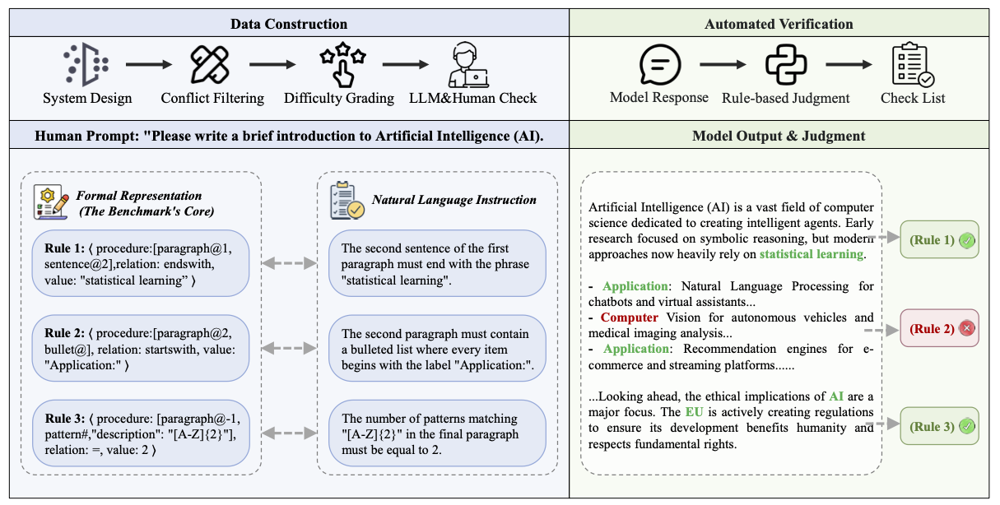

<div align="center">

# LexInstructEval
## Lexical Instruction Following Evaluation for Large Language Models

Huimin Ren<sup>1*</sup>, Yan Liang<sup>2*</sup>, Baiqiao Su<sup>2</sup>, Chaobo Sun<sup>1†</sup>, <br> Hengtong Lu<sup>1</sup>, Kaike Zhang<sup>1</sup>, Chen Wei<sup>1</sup>

<sup>1</sup>Li Auto Inc., <sup>2</sup>Beijing University of Posts and Telecommunications

<!-- ArXiv Badge -->
[](https://aaai.org/)
[](https://arxiv.org/abs/2511.17561)
[](LICENSE)
[](https://www.python.org/)

</div>

---

<p align="center">
  
</p>

## 📢 News
*   **[2025-11]** We released the code and bilingual datasets.
*   **[2025-11]** 🎉 **LexInstructEval** has been accepted to **AAAI 2026**!

## 📖 Abstract

Evaluating the ability of Large Language Models (LLMs) to follow complex, fine-grained lexical instructions remains a significant challenge. Existing methods either rely on costly human evaluation or "LLM-as-a-judge" systems, which suffer from inherent biases and unreliability.

We introduce **LexInstructEval**, a new benchmark and evaluation framework designed for **fine-grained lexical instruction following**.
*   **Formal Grammar:** Built upon a canonical < Procedure, Relation, Value > triplet.
*   **Bilingual:** Contains both English and Chinese datasets (~2.5k instructions).
*   **Objective Verification:** Features a transparent, programmatic verification engine that achieves **97% consistency** with expert human annotators, eliminating the need for LLM judges.

## 🚀 Key Features
- **Low Cost & Fast:** Purely rule-based verification; no API costs or slow model inference required for evaluation.
- **High Granularity:** Tests constraints from the paragraph level down to specific characters.
- **Explainable:** Provides detailed feedback on exactly which rule failed (e.g., *"The second sentence did not end with 'future'"*).
- **Multi-Metric:** Supports both **Strict Accuracy** (exact compliance) and **Loose Accuracy** (robust to formatting noise).

## 📂 Dataset Structure
The dataset is located in the `data/` directory. Each entry contains a detailed instruction and the corresponding formal rules for verification.

| Dataset | Language | Difficulty Levels | Count |
| :--- | :---: | :---: | :---: |
| `lex_instruct_en.jsonl` | English | Easy, Medium, Hard | 1,243 |
| `lex_instruct_zh.jsonl` | Chinese | Easy, Medium, Hard | 1,232 |

## 🛠️ Usage

### 1. Installation
Clone this repository and install the required packages:

```bash
git clone https://github.com/huiminren/LexInstructEval.git
cd LexInstructEval
pip install -r requirements.txt
```

### 2. Inference (Model Generation)
To evaluate your model, you need to generate responses for the instructions provided in the `data` directory.

1.  **Input:** Read the `.jsonl` files (e.g., `data/lex_instruct_en.jsonl`).
2.  **Generate:** Feed the `instruction` field to your LLM.
3.  **Output:** Save the model's response into a new `answer` field in the JSON object.

**Format Example:**
```json
{
  "id": 1,
  "instruction": "The second sentence of the final paragraph must contain the word 'future'.",
  "constraints": [...],
  "answer": "Here is the generated text... We look towards the future."
}
```

### 3. Evaluation
Run the automated verification script `eval.py`.

```bash
# Evaluate your generated file
python eval.py --input_file data/your_model_output.jsonl
```
*(Note: Please ensure the `input_file` path points to the file containing your model's answers.)*

The script will compute and display:
*   **Strict Accuracy**: Percentage of responses passing verification directly.
*   **Loose Accuracy**: Percentage passing after minor formatting normalization.

## 📊 Leaderboard (Preview)
Results on LexInstructEval (averaged over 4 runs). See the paper for full details.

| Model | English (Strict) | Chinese (Strict) | Overall (Strict) |
| :--- | :---: | :---: | :---: |
| **GPT-o3-2025-04-16** | **63.5%** | **76.9%** | **70.2%** |
| GPT-4o-2024-11-20 | 26.6% | 29.1% | 27.8% |
| Gemini-2.5-Pro | 49.7% | 52.0% | 50.9% |
| DeepSeek-R1-0528 | 33.4% | 44.0% | 38.7% |

## 📝 Citation
If you find this repo useful, please cite our AAAI 2026 paper:

```bibtex
@article{ren2025lexinstructeval,
  title={LexInstructEval: Lexical Instruction Following Evaluation for Large Language Models},
  author={Ren, Huimin and Liang, Yan and Su, Baiqiao and Sun, Chaobo and Lu, Hengtong and Zhang, Kaike and Wei, Chen},
  journal={arXiv preprint arXiv:2511.17561},
  year={2025},
  note={Accepted by AAAI 2026}
}
```

## 📧 Contact
For any questions or feedback, please file an issue or contact:
*   Huimin Ren: `hren@wpi.edu`